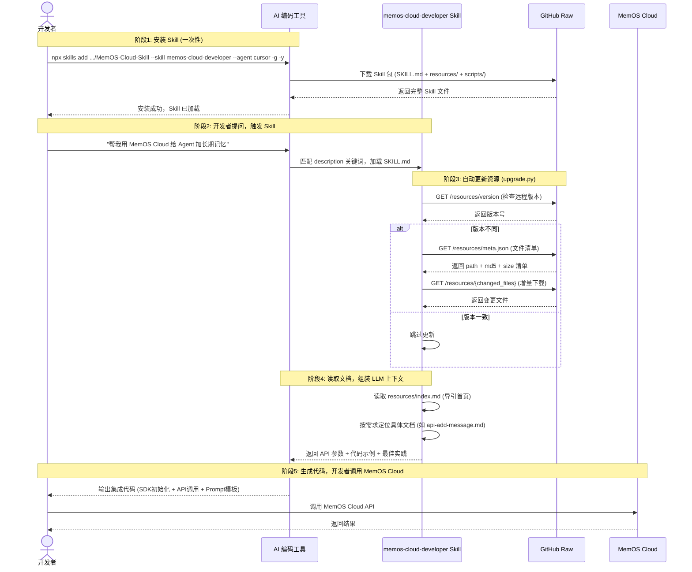

# MemOS Cloud Developer Skill

MemOS Cloud 开发者助手 Skill。通过自然语言描述需求，直接获得可运行的 API/SDK 集成代码，或对接入问题进行精准诊断。无需反复查阅文档，显著降低接入成本。

**支持的 SDK 语言：** Python、HTTP、cURL

**支持的编码工具：** Cursor、Trae、Trae-CN、Claude Code、Codex、OpenClaw、Hermes、Antigravity

## 安装方式

根据您使用的编码工具，运行对应的安装命令：

```bash
# Cursor
npx skills add https://github.com/shinetata/MemOS-Cloud-Skill --skill memos-cloud-developer --agent cursor -g -y

# Trae
npx skills add https://github.com/shinetata/MemOS-Cloud-Skill --skill memos-cloud-developer --agent trae -g -y

# Trae-CN
npx skills add https://github.com/shinetata/MemOS-Cloud-Skill --skill memos-cloud-developer --agent trae-cn -g -y

# Claude Code
npx skills add https://github.com/shinetata/MemOS-Cloud-Skill --skill memos-cloud-developer --agent claude-code -g -y

# Codex
npx skills add https://github.com/shinetata/MemOS-Cloud-Skill --skill memos-cloud-developer --agent codex -g -y

# OpenClaw
npx skills add https://github.com/shinetata/MemOS-Cloud-Skill --skill memos-cloud-developer --agent openclaw -g -y

# Hermes
npx skills add https://github.com/shinetata/MemOS-Cloud-Skill --skill memos-cloud-developer --agent hermes -g -y

# 所有 Agent 一次安装
npx skills add https://github.com/shinetata/MemOS-Cloud-Skill --skill memos-cloud-developer --all -g -y
```

安装完成后，在工具的 Agent 面板中可以看到 **memos-cloud-developer** Skill 已加载，即表示安装成功。

> 调用本 Skill 时，会自动执行 `scripts/upgrade.py` 脚本，升级最新的资料库。

## 卸载方式

```bash
npx skills remove -s memos-cloud-developer -g -y
```

## 环境准备

1. 注册并登录 [MemOS Cloud](https://memos-dashboard.openmem.net/quickstart)
2. 在 [API Key 页面](https://memos-dashboard.openmem.net/apikeys) 获取 API Key
3. 准备 Python 3.10+ 环境，安装 SDK：`pip install MemoryOS -U`

## 快速上手

安装完成后，直接在 Agent 对话框中用自然语言描述您的需求即可。以下是典型业务场景示例：

### 场景 1：为 AI Agent 添加长期记忆

> **场景：** 开发者希望让 Agent 记住用户偏好、历史行为和对话信息，实现个性化交互。
>
> **适用业务：** AI 陪伴/聊天助手、智能客服、销售助手、教育辅导 Agent、个性化推荐。

**示例 Prompt：**

```
帮我用 MemOS Cloud Python SDK 给我的 Agent 加上长期记忆，包括初始化、写入对话记忆、检索记忆并注入 Prompt 的完整代码。
```

### 场景 2：构建带知识库的智能问答系统

> **场景：** 开发者需要上传企业文档建立知识库，结合用户个人记忆进行联合检索和问答。
>
> **适用业务：** 企业内部 FAQ、客服助手、产品文档问答、合规知识检索。

**示例 Prompt：**

```
我想用 MemOS Cloud 搭建一个企业知识库问答助手，请给我一套 Python 示例，包含知识库创建、文档上传、联合记忆检索和基于检索结果生成回答的调用流程。
```

### 场景 3：让 Agent 学会复用工具调用经验

> **场景：** 开发者希望将 Agent 的工具调用决策和结果沉淀为可检索记忆，减少重复试错。
>
> **适用业务：** 具备工具调用能力的 Agent、自动化工作流、DevOps 助手。

**示例 Prompt：**

```
帮我基于 MemOS Cloud 实现 Tool Memory 功能，把 Agent 的 tool_calls 写入记忆，并在后续对话中检索相关的工具使用经验。
```

## 核心能力

| API | 用途 |
|-----|------|
| addMessage | 写入对话/信息，自动生产记忆 |
| searchMemory | 语义检索相关记忆 |
| Chat | 内置记忆管理的一站式对话 API |
| addFeedback | 自然语言反馈修正记忆 |
| deleteMemory | 按用户或按 ID 删除记忆 |

| 功能特性 | 说明 |
|---------|------|
| 知识库 | 文档上传与联合检索 |
| Tool Memory | 工具调用记忆沉淀与复用 |
| Skill | 自动生成或上传可复用任务方法 |
| 多模态 | 支持图片、文档等多类型输入 |
| Memory Filters | 按标签/时间/Agent 精确筛选 |
| 异步模式 | 控制消息写入后的处理时机 |

## 集成方式

- **Python SDK / HTTP 直调** — 控制力最强，适合生产集成
- **CLI + Skill** — 最通用，跨框架
- **MCP** — 适合 Cursor、Claude Desktop、Cline 等支持 MCP 的客户端
- **OpenClaw Plugin** — 自动化程度最高

## 工作原理



## 资源更新

修改 `resources/` 目录下的文档后，在仓库根目录运行以下命令更新 meta 信息：

```bash
python3 tools/memos-cloud-developer/generate_meta.py
```

然后将变更提交并推送到仓库，已安装 Skill 的用户下次触发时会自动增量同步。

## License

[Apache-2.0](LICENSE)
